# EMAN


一个基于SSM框架与物品的协同过滤算法(ItemCF)的简单电子书推荐系统

---

## 界面截图

</img>

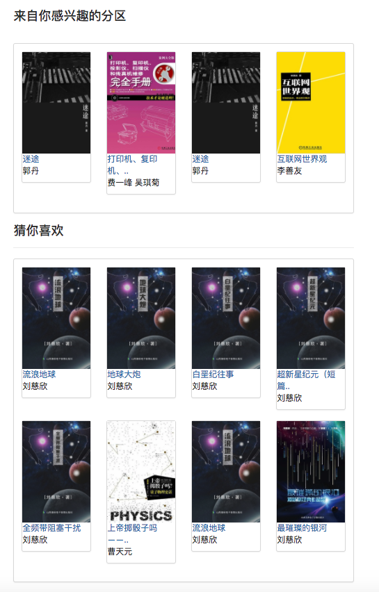</img>

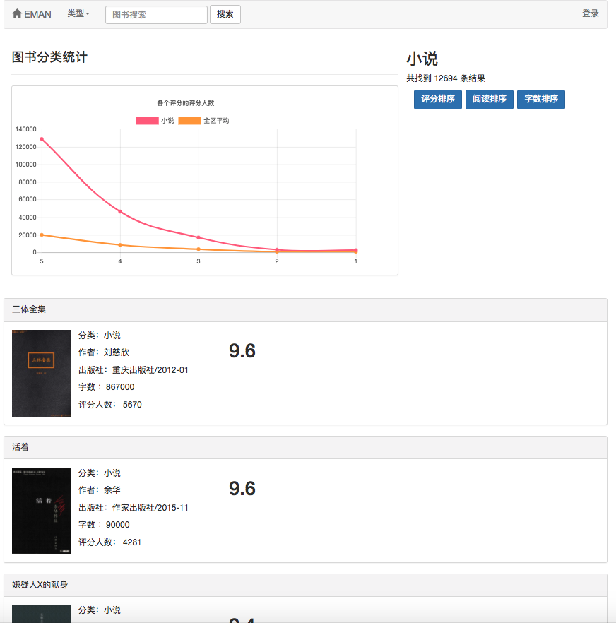</img>

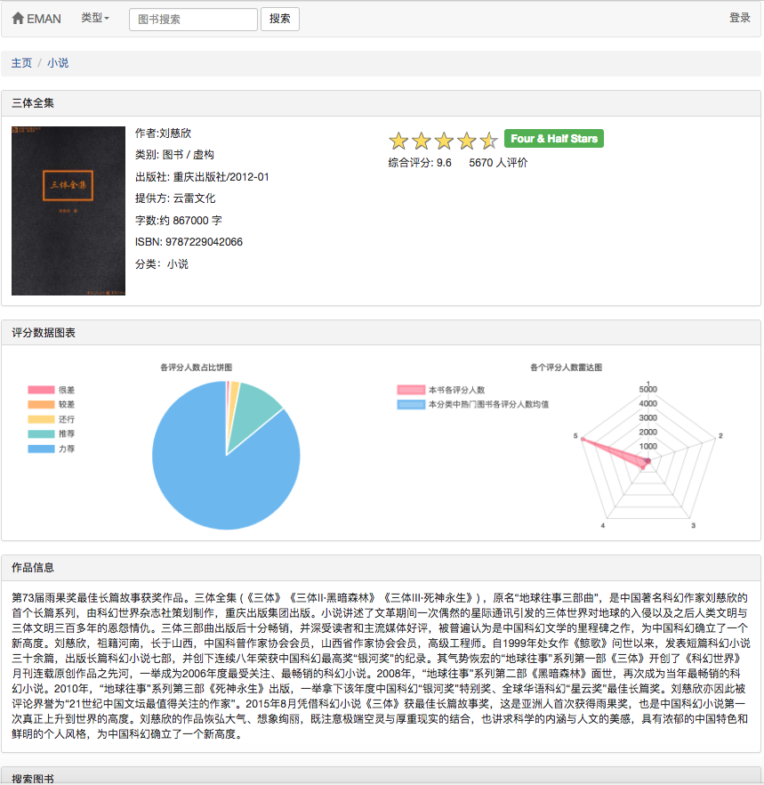</img>

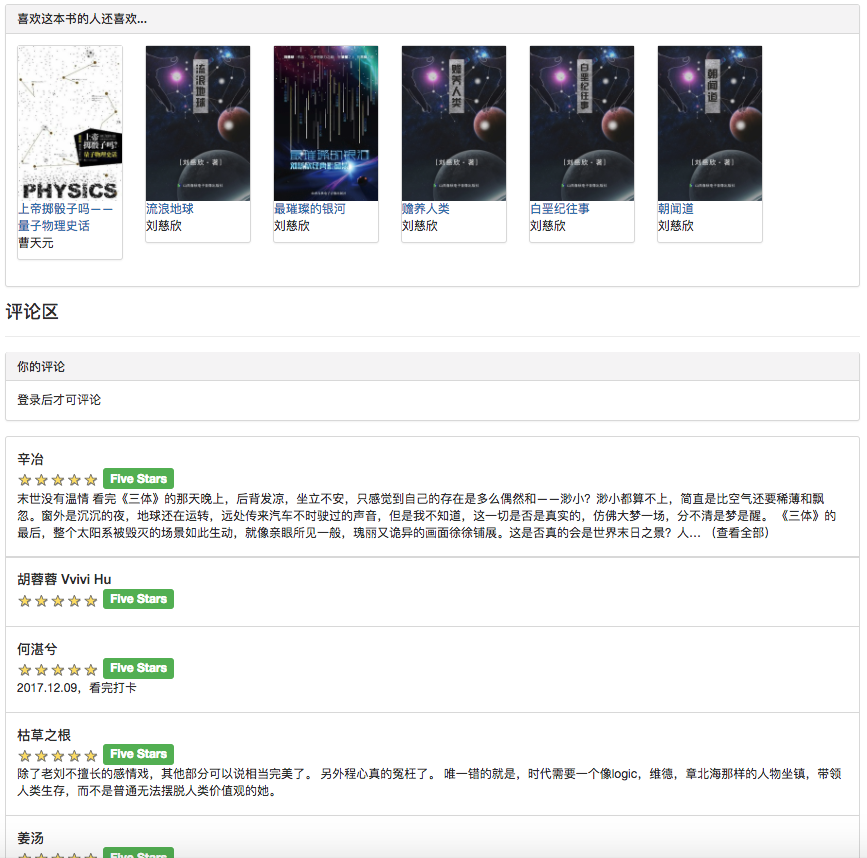</img>

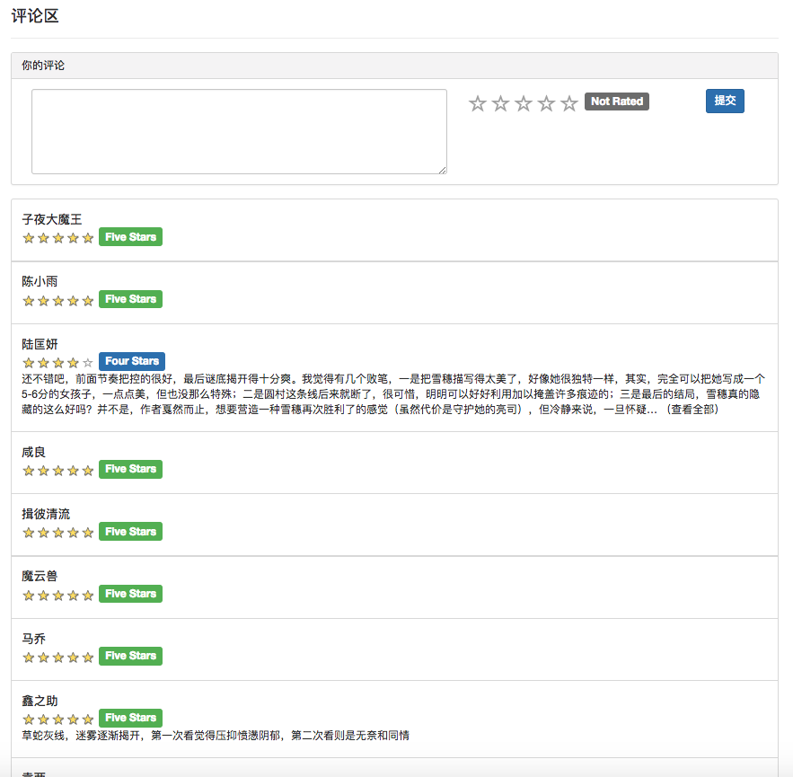</img>

</img>

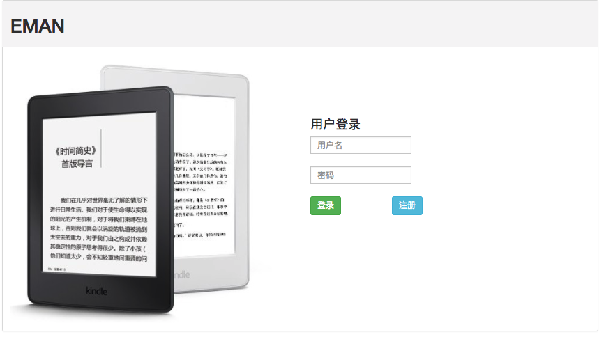</img>

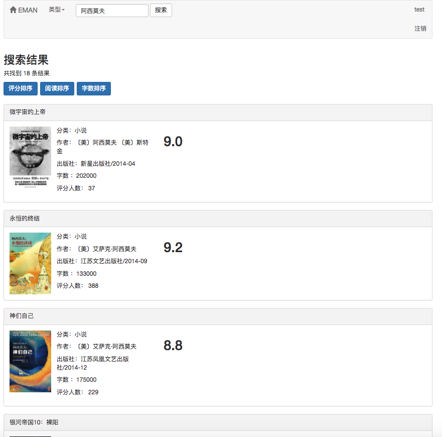</img>

## 系统功能分析

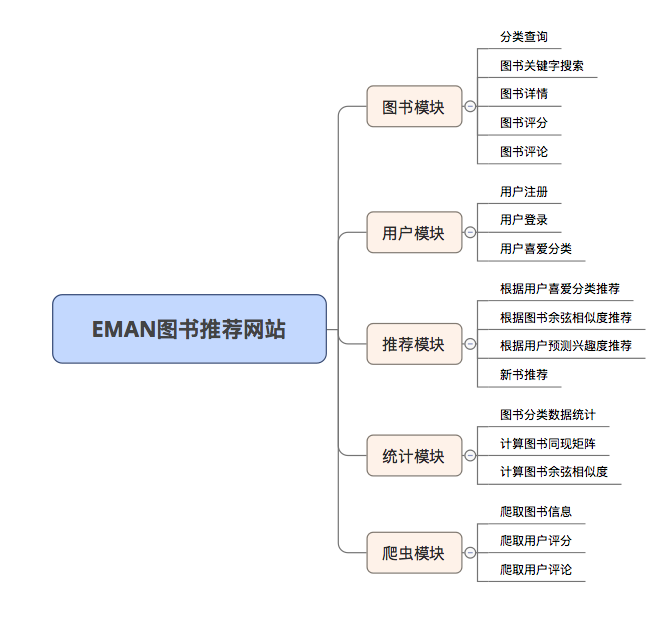

### 推荐策略

因部分推荐算法需要使用用户的喜爱数据作为参数。若用户未登录就采用对游客的 推荐策略。若用户已登录就采用对登录用户的推荐策略。其中若登录用户在数据库中存 在感兴趣的分区记录的话就会增加一个来自你感兴趣的分区的推荐。
所以将推荐策略分为是否登录两种情况进行区别。

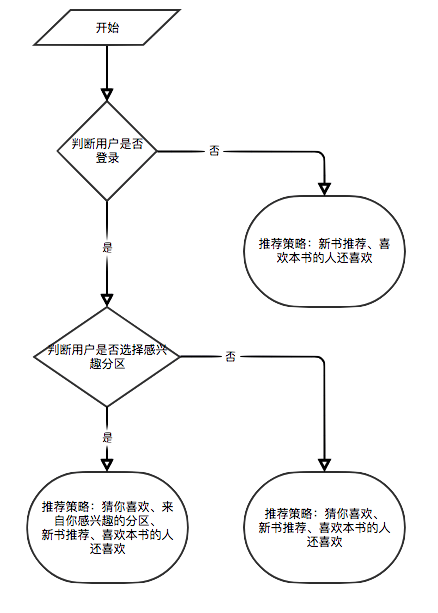

若用户未登录就采用对游客的用户评分显示策略。若用户已登录就采用对登录用户 的用户评分显示策略。其中若登录用户已经对当前详情页的电子书进行过评分，则显示 其评分记录。

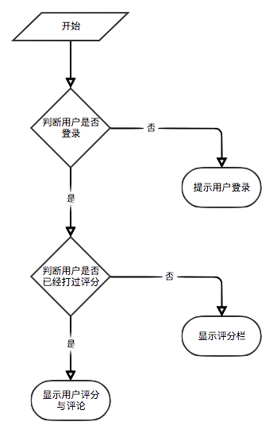

### 爬虫爬取策略

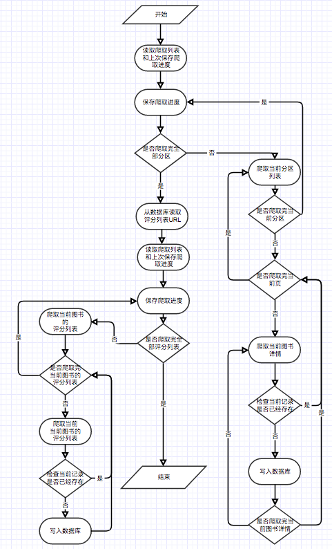</img>

## 系统分析与设计

### 系统分析

如用例图所示，本系统中的基本用户分为 3 种。分别是游客、注册用户、管理员。
游客可以访问电子书推荐平台的首页、用户注册页面、查看电子书页面。注册用户比游 客多的功能在于可以对电子书进行评分与评论和由该用户预测兴趣度决定的电子书推 荐。而管理员则可以定期使用爬虫模块来更新电子书信息和使用统计模块更新分类统计 信息、电子书同现矩阵和电子书余弦相似度矩阵。


### 推荐功能采用基于物品的协同过滤算法(ItemCF)

考虑到该算法存在冷启动问题。即对于新用户往往缺少评分数据从而导致根据用户预测兴趣度来进行推荐不能顺利进行。为解决该问题，我增加了使用余弦相似度矩阵 w 来直接进行相似电子书推荐的模块，方便未注册用户与新用户更好的获得推荐。而对于协同过滤算法存在的数据矩阵稀疏问题，即可能存在部分冷门电子书没有用户评分、电子书关联度不高、部分用户对电子书评分少等情况。为解决该问题，在首页上增加新书 推荐模块来更好的推荐没有人评分的电子书;在首页上增加根据用户选择感兴趣的分区 推荐模块以增加对具体的用户的兴趣来推荐电子书的拟合度。
值得注意的是，用户预测兴趣度推荐的电子书是在该算法所计算出来的余弦相似度矩阵 W 上使用公式计算而来。并且在计算的时候还需要用户喜爱的电子书作为输入参数。 而相似电子书推荐则是直接使用弦相似度矩阵 W 进行统计。这就意味着以上两个推荐需 要先完成电子书同现矩阵和电子书余弦相似度矩阵的计算才可以进行。因为以上两个矩阵计算量较大且每次计算都需要使用全部数据进行计算，所以在此设置成由管理员定期来执行。

### 系统设计

#### 数据库表

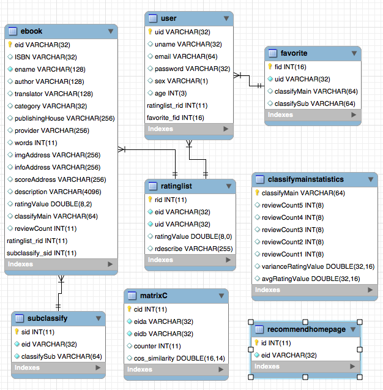</img>

<ol>
    <li>ebook：图书详情</li>
    <li>ratinglist：评分评论列表</li>
    <li>subclassify：图书副分类</li>
    <li>user：用户信息</li>
    <li>classifymainstatistics：主分类统计</li>
    <li>recommendhomepage：主页推荐书籍(待定)</li>
    <li>favorite：用户喜爱分类表</li>
    <li>matrixC：同现矩阵C与余弦相似度矩阵W表</li>
</ol>

#### 类和相关主要文件

>符号 &#8594; 表示该类为定期手动运行模块

<ol>
<li>com.controller</li>
    <ol>
        <li>EBookController：与图书相关的接口</li>
        <li>RatingListController：与用户评论、评分相关的接口</li>
        <li>StatisticsController：统计模块接口</li>
        <li>UserController：用户相关接口</li>
        <li>FavoriteController：用户喜爱分类接口</li>
        <li>ClassifyMainStatisticsController：分类统计相关接口</li>
    </ol>
<li>com.dao</li>
    <ol>
        <li>DBAccess：用于获取SqlSession数据库连接</li>
        <li>EBookDao：提供图书表的访问</li>
        <li>RatingListDao：提供评分评论表的访问</li>
        <li>UserDao：提供用户表的访问</li>
        <li>FavoriteDao：用户喜爱分类表的访问</li>
        <li>ClassifyMainStatisticsDao：分类统计相关数据表的访问</li>
        <li>MatrixCDao：提供同现矩阵C与余弦相似度矩阵W的访问</li>
        <li>EBookMapper.xml：提供图书表的访问的sql语句</li>
        <li>RatingListMapper.xml：提供评分评论表的访问的sql语句</li>
        <li>UserMapper.xml：提供用户表的访问的sql语句</li>
        <li>ClassifyMainStatisticsMapper.xml：提供主分区统计表的访问的sql语句</li>
        <li>FavoriteMapper.xml：用户喜爱分类表的访问的sql语句</li>
        <li>ClassifyMainStatisticsMapper.xml：分类统计相关数据表的访问的sql语句</li>
        <li>MatrixCMapper.xml：提供同现矩阵C与余弦相似度矩阵W的访问的sql语句</li>
    </ol>
<li>com.entity</li>
    <ol>
        <li>EBook：图书 -> ebook表</li>
        <li>RatingList：评论评分相 -> ratingList表</li>
        <li>ClassifyMainStatistics：主分区统计模块 -> classifyMainStatistics表</li>
        <li>User：用户 -> user表</li>
        <li>Favorite：用户喜爱分类实体 -> favorite表</li>
        <li>MatrixC：同现矩阵C与余弦相似度矩阵W -> matrixC表</li>
    </ol>
<li>com.service</li>
    <ol>
        <li>EBookService：图书模块</li>
        <li>RatingListService：评论评分模块</li>
        <li>UserService：用户模块</li>
        <li>FavoriteService：用户喜爱分类模块</li>
        <li>ClassifyMainStatisticsService：分类统计模块</li>
    </ol>
<li>com.statistics</li>
    <ol>
        <li>&#8594; ItemCollaborationFilter：用于计算基于物品的协同过滤推荐矩阵</li>
        <li>&#8594; StatisticsClassifyMain：统计主分类的各个分数的评分人数、平均评分、评分的方差</li>
        <li>&#8594; StatisticsRatingValue：图书评分信息统计：统计RatingValue表的数据并将统计结果写入到EBook表对应到图书上</li>
    </ol>
<li>com.util</li>
    <ol>
        <li>ChartDataJsonCreater：提供将数据转换为 Chart.js 插件专用的结构化 Json 数据格式</li>
        <li>JSONConverter：提供用于将 JavaBeans 对象直接转化为结构化 Json 数据</li>
        <li>RandomNumFactory：随机数生成工具类</li>
    </ol>
<li>spider(爬虫包)</li>
    <ol>
        <li>BookInfoSpider：爬取电子书详情页并存入数据库</li>
        <li>&#8594; EBookListSpider：爬取全部电子书</li>
        <li>HttpURLConnectionUtil：</li>
        <li>&#8594; RatingValueListSpider：爬取豆瓣图书评分列表与用户评论(从数据库读取图书信息并爬取图书的评分列表)</li>
    </ol>
<li>配置文件</li>
    <ol>
        <li>SSM框架配置文件</li>
        <ol>
            <li>applicationContext.xml：Spring 框架配置文件</li>
            <li>jdbc.properties：jdbc 配置文件</li>
            <li>mybatis-config.xml：MyBatis 框架配置文件</li>
            <li>web.xml：项目配置文件</li>
        </ol>
        <li>爬虫配置文件</li>
        <ol>
            <li>setting.properties：电子书爬虫(EBookListSpider)的配置文件</li>
            <li>user_spider_setting.properties：用户评论评分爬虫(RatingValueListSpider)的配置文件</li>
            <li>user_spider_exception.log：用户评论评分爬虫(RatingValueListSpider)的错误日志</li>
        </ol>
    </ol>
</ol>

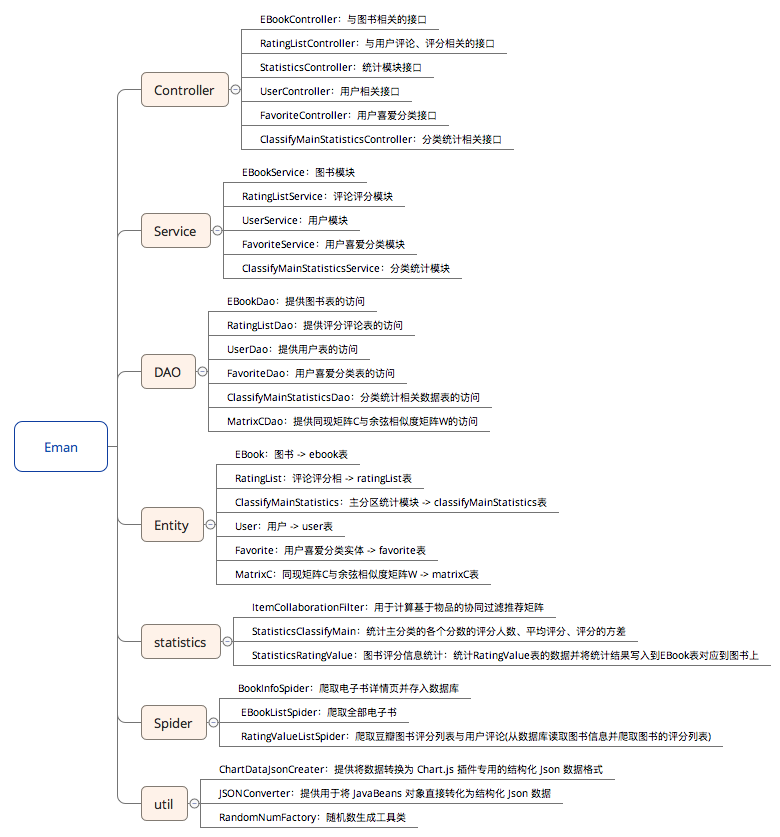</img>

#### 页面列表

<ol>
<li>index.jsp：主页</li>
<li>head.jsp：导航栏</li>
<li>error.jsp：错误信息页(待实现)</li>
<li>success.jsp：成功操作信息跳转页</li>
<li>/ebook(图书相关页面)</li>
    <ol>
        <li>list.jsp：主分类图书列表</li>
        <li>info.jsp：图书详情页</li>
        <li>serrchResult.jsp：图书搜索结果页</li>
    </ol>
<li>/user(用户相关页面)</li>
    <ol>
        <li>login.jsp：用户登录</li>
        <li>register.jsp：用户注册</li>
        <li>home.jsp：用户喜爱分类选择</li>
    </ol>
</ol>

## 系统实现

### 算法(基于物品的协同过滤算法(ItemCF))设计与实现

基于物品的协同过滤算法主要有两步:
1. 计算物品之间的相似度。
2. 根据物品的相似度和用户的历史行为给用户生成推荐列表。

设 N(i)是表示喜欢物品 i 的用户数。N(i)⋂N(j)表示同时喜欢物品 i 物品 j 的用户数。则物品 i 与物品 j 的相似度为:

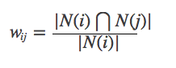

但是上式有一个缺陷:当物品 j 是一个很热门的商品时，人人都喜欢，那么 wij
就会很接近于 1，即上式会让很多物品都和热门商品有一个很大的相似度，所以可以改进一下公式:

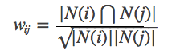

建立用户物品倒排表(设用大写字母表示用户，小写字母表示物品):

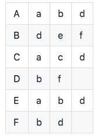

计算共现矩阵 C(共现矩阵 C 表示同时喜欢两个物品的用户数，是根据用户物品倒
排表计算出来的):

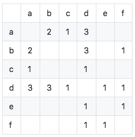

如图可知共现矩阵的对角线元素全为 0，且是实对称稀疏矩阵。 算法实现如下:

com.statistics.ItemCollaborationFilter

```java
    /**
	 * 计算共现矩阵C
	 */
	private void computerMatrixC(){
		// 建立用户物品倒排表
		// 若用户对物品评分大于等于4则认为喜欢(出现)
		List<User> allUser = userDao.queryAllUser();
		for(int i = 0; i < allUser.size(); i++){ // 遍历全部用户
			// 获取一个用户的评分列表中>=4的评分记录
			List<RatingList> likeList = ratingListDao.selectRatingListByUidAndRatingValue(allUser.get(i).getUid(), 4);
			if(likeList.size() <= 1){ // 若用户只喜欢一本或不喜欢任何图书
				continue;
			}
			
			for(int j = 0; j < likeList.size(); j++){ // 计算likeList中两两出现的图书并写入同现矩阵C
				for(int k = j+1; k < likeList.size(); k++){
					int a = Integer.valueOf(likeList.get(j).getEid());
					int b = Integer.valueOf(likeList.get(k).getEid());
					// 生成key
					String key = null;
					if(a < b){
						key = a + "," + b;
					}else{
						key = b + "," + a;
					}
					// 检查key是否已经存在
					if(this.matrixC.get(key) != null){
						int value = this.matrixC.get(key);
						this.matrixC.put(key, value+1);
					}else{
						this.matrixC.put(key, 1);
					}
				}
			}
			System.out.println("["+df.format(new Date())+"]"+"[已完成"+i+",共"+allUser.size()+"]:用户uid="+allUser.get(i).getUid()+"的记录以计算完成,共"+likeList.size()+"本图书"); 
		}
		
	}
```

统计可得每个物品出现的次数为:


计算余弦相似度矩阵 W:使用改进后的公式计算可得余弦相似度矩阵。

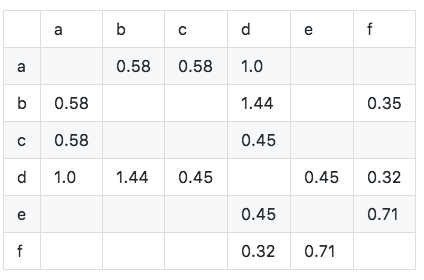

算法实现如下:

com.statistics.ItemCollaborationFilter

```java
/**
	 * 计算余弦相似度矩阵W
	 * 计算方法：
	 * 使用矩阵C的每个value作为分子，key中的两个图书的喜欢人数的积开根号作为分母
	 */
	private Double computerMatrixW(String eida, String eidb, int value){
		DecimalFormat df = new DecimalFormat("#.##");
		// 查询每个图书有多少人喜欢
        try {
            Statement statemenet = conn.createStatement();
            ResultSet rs = statemenet.executeQuery("select count(rid) from ratinglist where eid = '"+ eida +"' and ratingValue >= 4;");
            rs.next();
            int likeANum = rs.getInt("count(rid)");
            rs = statemenet.executeQuery("select count(rid) from ratinglist where eid = '"+ eidb +"' and ratingValue >= 4;");
            rs.next();
            int likeBNum = rs.getInt("count(rid)");
            if(likeANum == 0)
                likeANum = 1;
            if(likeBNum == 0)
                likeBNum = 1;
            // 开始计算
            Double answer = value*1.0/Math.sqrt(likeANum*likeBNum);
            // 精确到小数点后两位
            Double result = Double.parseDouble(df.format(answer));
            // 返回计算结果
            return result;
        } catch (SQLException e) {
            e.printStackTrace();
        }
		return null;
	}
```

最终推荐的是什么物品，是由预测兴趣度决定的。

物品j预测兴趣度 = 用户喜欢的物品i的兴趣度 × 物品i和物品j的相似度。

例如:某个用户喜欢物品 a、b 和 c。对其兴趣度分别为 1、2、2。那么物品 c、d、e、
f 的预测兴趣度分别为:
- c:1×0.58+2×0 +2×0=0.58
- d:1×1.0+2×1.44+2×0.45=4.78 
- e:1×0+2×0 +2×0=0.0 
- f:1×0+2×0.35+2×0=0.70 

所以应当向该用户推荐物品 d。 算法实现如下:

```java
	@Override
	public List<EBook> userRecommendedList(String uid) {
		// 获取用户喜爱图书列表
		List<RatingList> likeList = this.ratingListDao.selectRatingListByUidAndRatingValue(uid, 4);
		// debug
		System.out.println("uid="+uid+"用户喜爱图书列表");
		for(RatingList r : likeList){
			System.out.println(r.getEid()+","+r.getRatingValue());
		}
		System.out.println("likeList.size="+likeList.size());
		// 定义计算用矩阵
		List<Item> matrix = new ArrayList<>();
		// 将用户喜爱的图书作为矩阵的列
		// 将与用户喜爱的图书同现的图书作为矩阵的行
		// 建立工作矩阵
		for(int i = 0; i < likeList.size(); i++){ // 遍历用户喜爱的图书
			RatingList temp = likeList.get(i);
			// 获取同现图书
			List<MatrixC> itemList = this.matrixCDao.selectMatrixCByEidAOrEidB(temp.getEid(), temp.getEid());
			for(int j = 0; j < itemList.size(); j++){
				MatrixC c = itemList.get(j);
				// 从matrixC的key中选出同现图书的eid
				String sEid = null;
				if(c.getEida().equals(temp.getEid())){
					sEid = c.getEidb();
				}else{
					sEid = c.getEida();
				}
				// 在行中查询同现图书是否存在
				if(matrix.indexOf(sEid) == -1){ // 若列中不存在
					double[] col = new double[likeList.size()];
					// 将同现图书所在行对应喜爱图书的数组值设为对应的余弦相似度*用户喜爱程度(4分为1,5分为2)
					col[likeList.indexOf(temp)] = c.getCos_similarity()*(temp.getRatingValue()-3);
					matrix.add(new Item(sEid, col)); // 增加行

				}else{ // 若列中存在
					// 则将同现图书所在行对应喜爱图书的数组值设为对应的余弦相似度*用户喜爱程度(4分为1,5分为2)
					matrix.get(matrix.indexOf(sEid)).col[likeList.indexOf(temp)] = c.getCos_similarity()*(temp.getRatingValue()-3);
				}
			}
		}
		// 计算预测兴趣度
		for(int i = 0; i < matrix.size(); i++){
			Item item = matrix.get(i);
			double interestValue = 0;
			for(int j =0; j < item.col.length; j++){
				interestValue += item.col[j];
			}
			matrix.get(i).interestValue = interestValue;
		}
		// 根据预测兴趣度进行排序
		Collections.sort(matrix);
		// 返回推荐图书列表
		List<EBook> resultList = new ArrayList<>();
		for(int i = 0; i < matrix.size() && i < 20; i++){ // 返回排前10的书
			if(matrix.get(i).interestValue > 0){
				EBook eBook = this.eBookDao.queryEBookByEid(matrix.get(i).eid);
				resultList.add(eBook);
				// debug
				System.out.println(matrix.get(i).eid+","+eBook.getEname()+",interestValue="+matrix.get(i).interestValue);
			}
		}
		return EBookServiceImpl.initEBookImgAddress(resultList);
	}
```

推荐模块使用爬虫爬取的数据作为输入，将计算结果输出到 matrixC 表中。整个计算过程分为 2 个阶段来进行。第一阶段计算出共现矩阵 C。第二阶段计算出两两出现的电子书的余弦相似度 w。而对于根据用户预测兴趣度来推荐这一功能因为用户喜爱电子书数据的实时性和总计算量太大，则采用用户在访问页面时实时进行计算。经过多次测试，用户平均等待时间在可以接受的范围。


## 附录：数据

因为豆瓣电影网页升级加入反爬措施，所以在此提供用于运行推荐算法的数据

- 数据库数据
  - 见sql文件夹
- 图片数据
  - [百度网盘](https://pan.baidu.com/s/1Zsq1gI8RkSBsiJJUA9Gw4g)
  - 提取码: ycqu

---

<!--
## 待修复 BUG

1. window.location.href = "https://search.jd.com/Search?keyword=" + "${ebook.ename}" + "&enc=utf-8";若图书名中出现"则会导致注入

2. 访问图书详情页的时候ajax请求雷达图com.controller.RatingListController.getEBookReviewCountRadarChartData()可能会导致以下错误：

```
### Error querying database.  Cause: java.lang.ClassCastException: org.apache.ibatis.executor.ExecutionPlaceholder cannot be cast to java.util.List
### The error may exist in com/dao/RatingListMapper.xml
### The error may involve com.dao.RatingList.selectRatingListByEid
### The error occurred while executing a query
### Cause: java.lang.ClassCastException: org.apache.ibatis.executor.ExecutionPlaceholder cannot be cast to java.util.List
	at org.apache.ibatis.exceptions.ExceptionFactory.wrapException(ExceptionFactory.java:30)
	at org.apache.ibatis.session.defaults.DefaultSqlSession.selectList(DefaultSqlSession.java:122)
	at org.apache.ibatis.session.defaults.DefaultSqlSession.selectList(DefaultSqlSession.java:113)
	at com.dao.impl.RatingListDaoImpl.selectRatingListByEid(RatingListDaoImpl.java:30)
	at com.service.impl.RatingListServiceImpl.selectRatingListByEid(RatingListServiceImpl.java:31)
	at com.controller.RatingListController.getEBookReviewCountRadarChartData(RatingListController.java:264)
	at sun.reflect.NativeMethodAccessorImpl.invoke0(Native Method)
	at sun.reflect.NativeMethodAccessorImpl.invoke(NativeMethodAccessorImpl.java:62)
	at sun.reflect.DelegatingMethodAccessorImpl.invoke(DelegatingMethodAccessorImpl.java:43)
	at java.lang.reflect.Method.invoke(Method.java:498)
	at org.springframework.web.method.support.InvocableHandlerMethod.invoke(InvocableHandlerMethod.java:213)
	at org.springframework.web.method.support.InvocableHandlerMethod.invokeForRequest(InvocableHandlerMethod.java:126)
	at org.springframework.web.servlet.mvc.method.annotation.ServletInvocableHandlerMethod.invokeAndHandle(ServletInvocableHandlerMethod.java:96)
	at org.springframework.web.servlet.mvc.method.annotation.RequestMappingHandlerAdapter.invokeHandlerMethod(RequestMappingHandlerAdapter.java:617)
	at org.springframework.web.servlet.mvc.method.annotation.RequestMappingHandlerAdapter.handleInternal(RequestMappingHandlerAdapter.java:578)
	at org.springframework.web.servlet.mvc.method.AbstractHandlerMethodAdapter.handle(AbstractHandlerMethodAdapter.java:80)
	at org.springframework.web.servlet.DispatcherServlet.doDispatch(DispatcherServlet.java:923)
	at org.springframework.web.servlet.DispatcherServlet.doService(DispatcherServlet.java:852)
	at org.springframework.web.servlet.FrameworkServlet.processRequest(FrameworkServlet.java:882)
	at org.springframework.web.servlet.FrameworkServlet.doGet(FrameworkServlet.java:778)
	at javax.servlet.http.HttpServlet.service(HttpServlet.java:622)
	at javax.servlet.http.HttpServlet.service(HttpServlet.java:729)
```
-->
